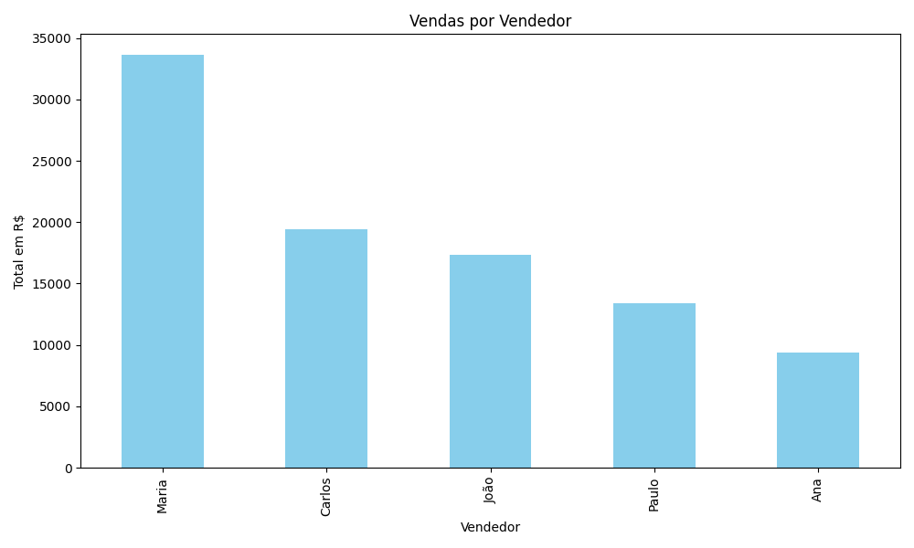
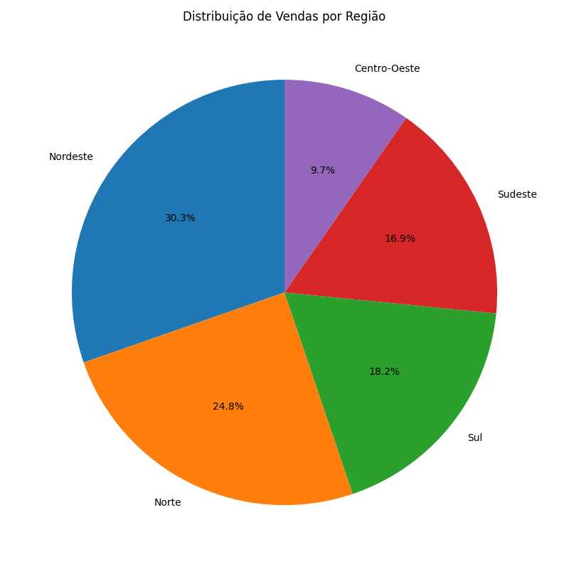

## 📊 Gráficos Gerados

### Vendas por Vendedor

### Vendas por Região

## Funcionalidades
- Leitura de planilhas de vendas
- Cálculo de totais por vendedor, região e produto
- Geração de planilha de relatório com múltiplas abas
- Criação de gráficos automáticos (PNG)

## Como usar
1. Coloque o arquivo `vendas.xlsx` na pasta `dados/`
2. Rode o script `relatorio_autovendas.py`
3. Veja os resultados na pasta `output/`

## Tecnologias usadas
- Python
- Pandas
- Matplotlib
- Openpyxl

